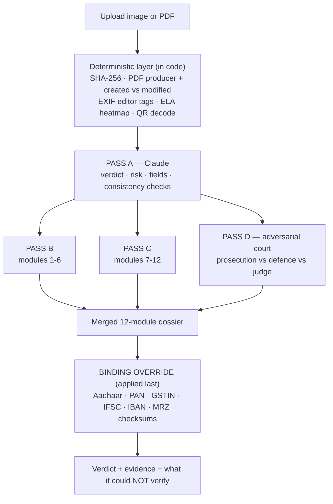

<p align="center">
  
</p>

<h1 align="center">DocsGuard</h1>
<p align="center"><b>Upload any document. Know in seconds if it's real.</b><br/>
AI document-authenticity &amp; fraud detection — deterministic forensics, Claude reasoning, and an adversarial review.</p>

<p align="center">
  
  
  
  
  
  
</p>

## Demo

<p align="center">
  
</p>

<p align="center">
  <a href="https://youtu.be/Vro11O8mgrs"></a>
</p>

<p align="center">
  <b><a href="https://youtu.be/Vro11O8mgrs">▶ Watch the demo on YouTube</a></b> &nbsp;·&nbsp;
  <a href="docs/assets/DocsGuard-Demo.mp4">Download MP4</a> &nbsp;·&nbsp;
  <a href="docs/DocsGuard-Deck.pdf">Pitch deck (16 slides)</a> &nbsp;·&nbsp;
  <a href="docs/DocsGuard-Explainer.pdf">Detailed explainer</a>
</p>

<p align="center"><i>A genuine certificate scores risk 2/100. The tampered copy is caught at 73 — with the evidence shown.</i></p>

---

## The problem

Fraudsters submit **fake and tampered documents** to claim what isn't theirs — forged
caste / income / domicile certificates and doctored bank statements for welfare schemes
(Ladli Behna, scholarships, subsidies, PDS), fabricated marksheets for jobs, and fake
turnover / experience / bank-guarantee papers in government tenders. Manual verification by
officers is slow, inconsistent, and doesn't scale — and the losses are enormous (India's DGGI
detected **₹36,374 cr** of fake-invoice GST-ITC fraud in FY24–25 alone; Madhya Pradesh's own
Vyapam and scholarship scandals show the human cost). The same fake-document problem hits
banks, landlords, employers and marketplaces every day.

## What DocsGuard does

Upload a document (photo or PDF). In seconds you get a clear, defensible verdict:

- 🟢 **AUTHENTIC / 🟡 SUSPICIOUS / 🔴 LIKELY FAKE** with a 0–100 **risk score** and confidence.
- 🚩 **Red flags** — each with the exact evidence on the document that triggered it.
- 🧮 **Cross-field consistency checks** — the standout: *does the maths and logic hold up?*
  (line items vs total, DOB vs age vs issue date, declared income vs bank balance, ID-format plausibility).
- 🔍 **Highlighted evidence** — suspicious regions boxed directly on the image.
- 🧾 **Extracted fields**, **technical signals**, a **recommended action**, and an honest list of
  **what still needs live source verification**.
- 🗂️ Scan **history** and one-click **print/export** of the report.

## Why it's different — the honest architecture

Most "AI verifiers" just ask a model and let it hallucinate registry hits and WHOIS data.
DocsGuard is built to be **trustworthy enough for a government officer**:

1. **Deterministic signals, in code** — SHA-256 fingerprint, file size, PDF producer +
   creation‑vs‑modification dates (`pdf-lib`), image EXIF / editor-software tags (`exifr`).
   These are *facts*, not guesses.
2. **Claude reasons over the real evidence** — `claude-opus-5` (vision + adaptive thinking)
   examines the pixels, OCR text and those verified signals, does deep **cross-field logic**,
   and may use **live web search** to check public facts.
3. **It never fabricates external lookups.** Anything that needs a live source (registry,
   DigiLocker/e-District, sanctions, bank confirmation) is listed under *externalChecksNeeded* —
   flagged, not invented. That boundary is the product's integrity.

## How it works

Deterministic facts first. The AI is not allowed to argue with them.



Passes B, C and D run **concurrently**. The checksum layer is applied **last** and outranks the model:
a number that fails its official checksum could not have been issued, so no argument can talk the
verdict back down.

## The adversarial court

A single AI pass either cries fraud at every compression artifact, or waves everything through. So the
review argues with itself:

| Role | Job |
|---|---|
| **Prosecution** | Strongest honest case that the document is forged — observable evidence only |
| **Defence** | The innocent explanation: scanner artifacts, recompression, a legitimate re-save |
| **Judge** | Weighs both against the binding computed facts; records what was **decisive** and what it **dismissed** |

That *dismissed* list is the false-positive guard, and the officer sees it.

## Proof

Measured, not claimed — reproduce these yourself:

| Claim | Command | Result |
|---|---|---|
| Identifier validation is real mathematics | `node --test api/verification.test.mjs` | **60/60 pass** — Verhoeff, PAN, GSTIN mod-36, IFSC, IBAN mod-97, ICAO 9303 MRZ |
| Forensic pipeline runs with no API key | `npm run selftest` | **5/5 pass** |
| ELA reacts to real pixel edits | included in selftest | mean error **0.196 → 0.264** on a spliced edit |
| It catches a real forgery end-to-end | upload `samples/tampered-income-certificate.jpg` | **LIKELY_FAKE**, risk 88, 12/12 modules |

Regenerate the specimen pair any time with `npm run samples`.

## Honest limitations

- **ELA is weak on flat, vector-rendered documents.** It was built for photographs; on a crisp
  certificate, ordinary body text produces as much error as a splice. Reported as one weak indicative
  signal, never as a verdict.
- **No source-of-truth verification yet.** Until DigiLocker / e-District integration, DocsGuard can say a
  certificate is internally consistent and structurally valid — not that the office actually issued it.
- **Confidence is self-reported** by the model, not calibrated against a labelled dataset.
- Signature/seal verification and copy-move detection need a separate Python/ONNX service. The public
  reference SDKs are `license: null` or AGPL and cannot be vendored — see
  [COMPETITIVE_RESEARCH.md](docs/COMPETITIVE_RESEARCH.md).

## Tech stack

React 19 · Vite 6 · TypeScript · Tailwind (CDN) · framer-motion · lucide-react ·
Outfit + Plus Jakarta Sans · Anthropic SDK (`claude-opus-5`) · `pdf-lib` · `exifr` ·
Vercel serverless functions · Supabase-ready history.

## Quickstart

```bash
npm install
# add your key to .env.local:  ANTHROPIC_API_KEY=sk-ant-...
npm run dev            # http://localhost:3000
```

Full local + Vercel + Supabase instructions: **[docs/SETUP.md](docs/SETUP.md)**.

## Documentation

| Doc | What's inside |
|---|---|
| [PRODUCT.md](docs/PRODUCT.md) | Problem, solution, PRD, roadmap |
| [ARCHITECTURE.md](docs/ARCHITECTURE.md) | System + analysis pipeline, data model, security |
| [FORENSIC_METHODOLOGY.md](docs/FORENSIC_METHODOLOGY.md) | Exactly how a verdict is reached |
| [FRAUD_TYPOLOGIES.md](docs/FRAUD_TYPOLOGIES.md) | Document-fraud catalog (cited, India + universal) |
| [DATA_SOURCES.md](docs/DATA_SOURCES.md) | DigiLocker / Aadhaar / registries / sanctions — integration roadmap |
| [DESIGN_SYSTEM.md](docs/DESIGN_SYSTEM.md) · [MOTION.md](docs/MOTION.md) | The white+blue design system & motion spec |
| [PITCH_DECK.md](docs/PITCH_DECK.md) · [DEMO_SCRIPT.md](docs/DEMO_SCRIPT.md) · [IMPACT.md](docs/IMPACT.md) | For the pitch |

## Roadmap

DigiLocker / e-District source-of-truth verification · Aadhaar offline-QR signature check ·
GST / PAN / MCA / IEC registry lookups · sanctions & reverse-image · officer dashboard,
bulk + API, tamper-proof audit trail. Priorities in [docs/DATA_SOURCES.md](docs/DATA_SOURCES.md).

---

> ⚠️ DocsGuard assists human review; it does not replace source verification. Every report lists
> what still needs a live check. Verdicts are AI-assisted assessments, not legal determinations.
