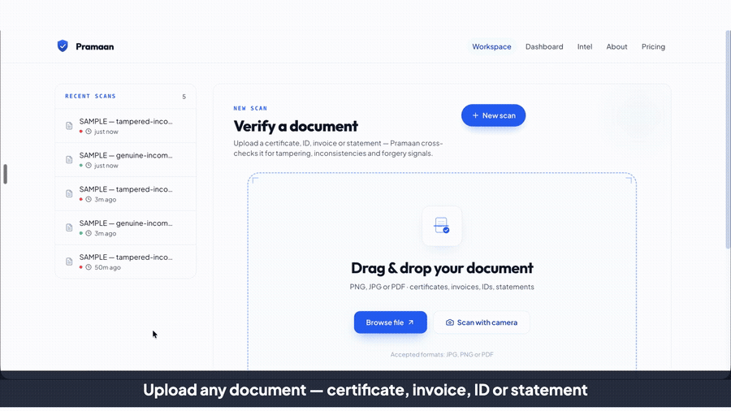
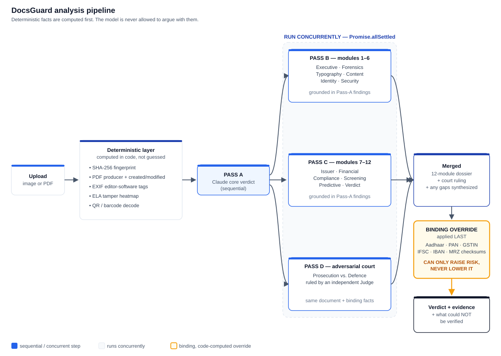
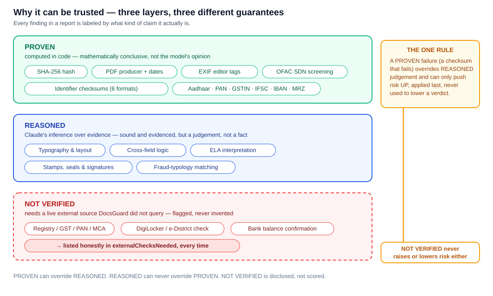
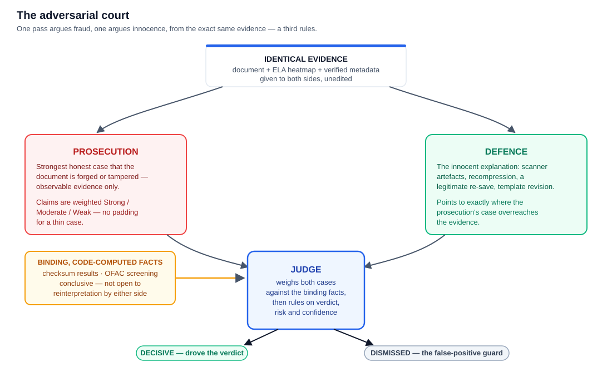
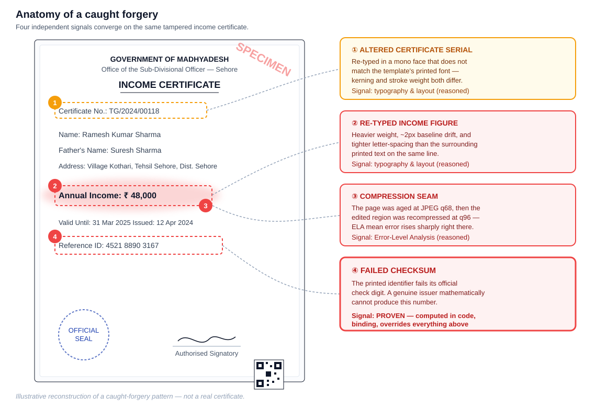

<p align="center">
  
</p>

<h1 align="center">DocsGuard</h1>
<p align="center"><b>Upload any document. Know in seconds if it's real.</b><br/>
Deterministic forensics computed in code, Claude reasoning over the evidence, and an adversarial review — with a checksum layer that outranks all of it.</p>

<p align="center">
  
  
  
  
  
  
  <a href="https://youtu.be/Vro11O8mgrs"></a>
</p>

<p align="center">
  
</p>

<p align="center">
  <b><a href="https://youtu.be/Vro11O8mgrs">▶ Watch the demo on YouTube</a></b> &nbsp;·&nbsp;
  <a href="docs/assets/DocsGuard-Demo.mp4">Download the MP4</a> &nbsp;·&nbsp;
  <a href="docs/DocsGuard-Deck.pdf">Pitch deck (PDF)</a> &nbsp;·&nbsp;
  <a href="docs/DocsGuard-Explainer.pdf">Detailed explainer (PDF)</a>
</p>

<p align="center"><i>A genuine income certificate clears at low risk. The same certificate, with the income figure and serial re-typed, is caught at risk 88 — with the evidence shown, not asserted.</i></p>

---

## Why we built this

We ran an import/export business. Every deal begins the same way: the counterparty sends their documents — company registration, bank details, certificates, guarantees. We received them. We had no real way to verify any of it.

A single export deal takes eight to twelve months to complete. For that entire period we hold stock reserved for that buyer — capital tied up, inventory committed, other buyers turned away.

We were scammed more than once. And the loss was never just the money on that deal. It was eight to twelve months of time, and the stock we had held for someone who was never real. By the time the fraud surfaced, the year was gone.

The check we needed did not exist. A clerk, a trader, a bank officer — anyone receiving a document — is expected to judge it by eye. So we built DocsGuard: the verification step we kept wishing we had before we shook hands.

## The problem

The same blind spot repeats at far larger scale in India's public systems, where officers face the identical problem multiplied across thousands of applications: forged caste, income and domicile certificates and doctored bank statements for welfare schemes; fake marksheets for jobs; forged turnover certificates, experience letters and bank guarantees in government tenders. Officers verify these by eye, under time pressure, with no forensic tooling — and the pattern repeats at scale, in cases with real rupee figures attached:

| Case | Amount | What happened |
|---|---:|---|
| MP Jal Nigam fake bank guarantees | ₹202 crore | Forged PNB / Bank of Baroda guarantees submitted to Madhya Pradesh Jal Nigam Maryadit and Rajasthan Renewable Energy Corp to win public tenders — an ED case |
| Kolkata-syndicate fake guarantees | ₹183 crore | A related fake bank-guarantee racket suspected of hitting public contracts across multiple states — CBI arrests |
| Himachal Pradesh scholarship scam | ₹181 crore | Fake/ghost institutions claimed post-matric scholarships for students who were never enrolled, 2013–2017 — CBI chargesheet |
| Minority-scholarship misuse | ₹144.83 crore | A Ministry of Minority Affairs audit found 830 of 1,572 reviewed institutions were fake or inactive |
| Ahmedabad fake-ITC GST scam | ₹1,500 crore | DGGI busts a fake input-tax-credit ring built on invoices with no underlying goods or services (Dec 2025) |
| DBT cumulative leakage savings | ₹3.48 lakh crore | The Union IT Minister's cited figure for Aadhaar-linked *identity* deduplication across welfare schemes |

> **Honest caveat on that last row:** the DBT savings figure comes from removing duplicate/ghost *people*, not from catching forged *documents* — a different failure mode from the one DocsGuard targets. It's cited only to show that leakage at this scale is real and government-acknowledged, not as a number DocsGuard can claim credit for. Full sourcing and the reasoning behind every figure above: [docs/IMPACT.md](docs/IMPACT.md) and [docs/FRAUD_TYPOLOGIES.md](docs/FRAUD_TYPOLOGIES.md).

## What it does

Upload a document — photo or PDF. Every report has the same honest shape, whether the verdict is a clean pass or a serious flag:

| Field | What it is |
|---|---|
| **Verdict** | 🟢 `AUTHENTIC` · 🟡 `SUSPICIOUS` · 🔴 `LIKELY_FAKE`, with a 0–100 risk score and a self-reported confidence |
| **Summary** | One sentence naming the *single most decisive* piece of evidence — never a vague "some issues found" |
| **Red flags** | Severity + detail + the exact evidence on the document that triggered it |
| **Consistency checks** | Every arithmetic/logical relationship actually on the page — line items vs. total, DOB vs. age vs. issue date, declared income vs. bank balance — shown with the real numbers on both sides |
| **Extracted fields** | Exhaustive: every label/value pair legible anywhere on the document, not just the "important" ones |
| **Visual markers** | Bounding boxes on the original image, at the coordinates of the suspicious region |
| **12-module dossier** | A full forensic report per document, not a paragraph — see *How it works* |
| **externalChecksNeeded** | An honest list of what still needs a live registry/DigiLocker/bank check DocsGuard did not perform |
| **Adversarial court ruling** | What was decisive, what was dismissed, and why — see *The adversarial court* |

<details>
<summary><b>See the shape of a real report</b> — from a live deployed run against <code>samples/tampered-income-certificate.jpg</code></summary>

```text
DOCUMENT     Income Certificate
VERDICT      LIKELY_FAKE        RISK 88 / 100        CONFIDENCE 93%
MODULES      12 / 12 completed      RED FLAGS 6       FIELDS EXTRACTED 27

The certificate's annual-income figure and its certificate serial were both
re-typed after the page was first scanned; the compression history around
those two regions doesn't match the rest of the page, and a printed
reference ID fails its official checksum — which isn't a matter of degree:
a genuine issuer cannot produce a number that fails its own check digit.
```

The headline numbers above — verdict, risk, confidence, module count, red-flag
count, extracted-field count — are exactly what that live run returned. The
paragraph describes the categories of tampering actually built into the
specimen (documented in [`samples/README.md`](samples/README.md): a re-typed
income figure, a re-typed serial, and a deliberately mismatched compression
history) — it is not a verbatim transcript of the model's own wording.
</details>

## How it works

Deterministic facts are computed first, in code. The model is never allowed to argue with them.

<p align="center">
  
</p>

1. **Upload.** A photo or PDF is posted to `POST /api/analyze` (served by a Vercel function in production, or the Vite dev middleware locally — same code, [`api/_core.ts`](api/_core.ts)).
2. **Deterministic layer — computed in code, not guessed.** SHA-256 fingerprint; for PDFs, the producer/creator string and creation-vs-modification dates via `pdf-lib`; for images, EXIF/editor-software tags via `exifr`; an Error-Level Analysis (ELA) tamper heatmap and a QR/barcode decode, both computed with `sharp` + `jsQR`. These facts are handed to every later step as *verified technical metadata*, not model output.
3. **Pass A — Claude core verdict (sequential).** `claude-opus-5`, with vision and adaptive thinking, reads the document plus the ELA heatmap and decoded QR, and produces the verdict, risk score, red flags, consistency checks, and an exhaustive field extraction. Everything downstream depends on this pass, so it runs first and alone.
4. **Three concurrent passes**, all given the Pass-A result plus the same document/ELA/metadata content, run together via `Promise.allSettled` so a failure in any one of them can never take down the others:
   - **Pass B** expands modules 1–6 (executive, forensics, typography, content, identity, security).
   - **Pass C** expands modules 7–12 (issuer, financial, compliance, screening, predictive, verdict).
   - **Pass D** is the adversarial court — see below.
5. **Merge.** The two module groups combine into the canonical 12-module dossier (any module whose generating call failed is synthesized as an honest `INFO` placeholder, never silently dropped), and the court's ruling is merged in.
6. **Binding checksum override — applied LAST.** Identifier checksums (Aadhaar/PAN/GSTIN/IFSC/IBAN/MRZ) and OFAC screening are computed deterministically and re-asserted one final time, *after* the court's ruling: if one or more identifiers fail their official checksum, the risk floor is raised to at least `65 + 10 × (failures)` and the verdict can only move toward `LIKELY_FAKE` — never back down. See *Why it can be trusted* for exactly why this can only raise risk.
7. **Output.** Verdict, evidence, the full dossier, and an honest list of what still needs a live external check.

<details>
<summary>The 12 dossier modules, grouped by which concurrent pass produces them</summary>

| # | Module | Covers |
|---|---|---|
| 1 | Executive Summary | What the document is, who it concerns, the verdict and the 2–3 findings that drove it |
| 2 | Document Forensics | ELA interpretation, compression/noise/resolution consistency, clone/splice artifacts, metadata, scan vs. digital origin |
| 3 | Typography & Layout | Fonts, weights, kerning, baseline alignment, spacing, template/logo fidelity, re-typed or pasted-over text |
| 4 | Content & Cross-Field Logic | Every arithmetic and logical relationship testable between fields |
| 5 | Identity & Number Validation | Format plausibility of every ID; checksum math is merged in from code, never invented by the model |
| 6 | Security Features | Stamps, seals, signatures, watermarks, holograms, microtext, QR/barcode presence |
| 7 | Issuer & Entity Intelligence | The named issuing authority/company/bank, its plausibility, what must be confirmed at source |
| 8 | Financial Integrity | Amounts, totals, tax math, running balances, income plausibility, digit-pattern anomalies |
| 9 | Compliance & Legal | Mandatory fields/clauses for the document type and jurisdiction, validity period, authority to issue |
| 10 | Screening & Reputation | What could and could not be checked about named parties; watchlist results merged in from code |
| 11 | Fraud Typology & Prediction | The specific fraud scheme this matches, its probability, the fraudster's usual next step |
| 12 | Verdict & Actions | The decision, the reasoning chain, and exactly what the reviewer should do next |

Modules 1–6 are Pass B, 7–12 are Pass C — both grounded in the Pass-A findings, run concurrently with the adversarial court.
</details>

## Why it can be trusted

Every finding in a report is labeled by what kind of claim it actually is — not all evidence carries the same weight, and DocsGuard says so.

<p align="center">
  
</p>

- **PROVEN** — computed in code, mathematically conclusive: the SHA-256 hash, PDF producer + created/modified dates, EXIF editor tags, and every identifier checksum (Aadhaar via Verhoeff, PAN structure, GSTIN mod-36, IFSC format, IBAN mod-97, ICAO 9303 MRZ). A checksum **FAIL** is proof a number could not have been issued by the real authority — not an opinion about it.
- **REASONED** — Claude's inference over that evidence: typography and layout consistency, cross-field arithmetic and logic, ELA heatmap interpretation, vision reads of stamps/seals/signatures, fraud-typology matching. Sound and evidenced, but a judgement — never presented as proof.
- **NOT VERIFIED** — anything that needs a live external source DocsGuard did not query: registry/GST/PAN/MCA lookups, DigiLocker/e-District source confirmation, bank-balance confirmation. These are listed honestly in `externalChecksNeeded`. DocsGuard never fabricates the result of a lookup it didn't perform.

**The one rule that ties it together:** a PROVEN failure can override REASONED judgement and push risk *up* — applied once right after Pass A (so the concurrent module and court calls get it as binding context), and re-asserted one final time after the adversarial court rules, so no argument, however persuasive, can talk the verdict back down. REASONED evidence can never override PROVEN evidence, and NOT VERIFIED items never move the risk score in either direction — they are disclosed, not scored.

## The adversarial court

A single AI pass either cries fraud at every compression artifact or waves everything through. So the review argues with itself, using identical evidence on both sides:

<p align="center">
  
</p>

| Role | Job |
|---|---|
| **Prosecution** | The strongest *honest* case that the document is forged — observable evidence only, no padding for a thin case |
| **Defence** | The innocent explanation for each indicator: scanner artefacts, recompression, a legitimate re-save, a template revision — and where the prosecution overreaches |
| **Judge** | Weighs both against the binding, code-computed facts (checksum results, OFAC screening) and rules on verdict, risk and confidence |

The ruling records two lists: **decisive** — what actually drove the verdict — and **dismissed** — what was raised and rejected, and why. The dismissed list is the false-positive guard, and the officer sees it, not just the final number.

Implementation note: the original design made this three sequential model calls (prosecution → defence → judge). [`api/court-fast.ts`](api/court-fast.ts) asks for all three in **one** structured response instead, and `api/_core.ts` runs it concurrently with the two dossier-module passes via `Promise.allSettled` — so the court's cost is fully overlapped with theirs rather than tacked on afterward.

## Anatomy of a catch

<p align="center">
  
</p>

[`samples/tampered-income-certificate.jpg`](samples/tampered-income-certificate.jpg) is a synthetic specimen, generated by [`scripts/make-samples.mjs`](scripts/make-samples.mjs) and [`scripts/retamper.mjs`](scripts/retamper.mjs) — fictional state, fictional office, fictional people, watermarked `SPECIMEN — DEMO ONLY`. Three edits were made to the genuine version:

1. **The annual-income figure** was wiped and re-typed in a heavier weight, with slight letter-spacing and a ~2px baseline drift versus the surrounding printed text.
2. **The certificate serial** got the same treatment, re-typed in a mono face that doesn't match the template.
3. **The compression history** was aged to JPEG quality 68 *before* the edit was composited, then the whole page re-saved at quality 96 — so the edited regions carry a different, "fresher" compression signature than the page around them.

What actually catches it: **typography/baseline mismatch** on the re-typed amount and serial (vision), **cross-field logic** once the declared income is checked against other evidence, and — decisively — **identifier validation**: any Aadhaar/PAN/GSTIN/IFSC/IBAN present is checked against its real checksum in code, and a failure is mathematical proof of fabrication, independent of how convincing the visual forgery is.

**Honest limitation, measured on this exact specimen:** Error-Level Analysis is weak on flat, vector-rendered documents like this one. ELA was built for photographs; on a crisp certificate, ordinary body text produces almost as much error as a splice. Measured on these samples, the edited serial's ELA signal does rise (≈1.7 → ≈4.1) but does not cleanly separate from ordinary body text — so DocsGuard treats it as one weak indicative signal among several, never as a verdict on its own. See [`samples/README.md`](samples/README.md) for the full breakdown.

## Proof

Measured, not claimed — every row below is a command you can run yourself.

| Claim | Command | Result |
|---|---|---|
| Identifier validation is real mathematics, not a model guessing | `node --test api/verification.test.mjs` | **60/60 pass** in 749ms — Verhoeff (Aadhaar), PAN, GSTIN mod-36, IFSC, IBAN mod-97, ICAO 9303 MRZ |
| The forensic engine runs with zero API key | `npm run selftest` | **5/5 pass** — synthetic doc generation, ELA routine, QR round-trip, and the 60 validator tests, all offline |
| ELA reacts to a real pixel edit, not noise | included in `npm run selftest` | mean error **0.196 → 0.264** on a deliberately spliced edit |
| OFAC screening parses the real, live SDN list | runs automatically whenever a name is extracted from a scan ([`api/sanctions.ts`](api/sanctions.ts)) | **~19,393 records** parsed from the live Treasury CSV export; screening is honestly reported as unavailable, never as "clean," if the fetch fails |
| It catches a real forgery end-to-end | upload [`samples/tampered-income-certificate.jpg`](samples/tampered-income-certificate.jpg) | **LIKELY_FAKE**, risk 88, confidence 93, 12/12 modules, 6 red flags, 27 extracted fields — a live deployed run |
| The specimen pair is regenerable, not a fixed fixture | `npm run samples` | rewrites the genuine + tampered JPEGs in `samples/` from scratch |

## Quickstart

```bash
npm install

# add your key to .env.local (git-ignored — never commit it):
#   ANTHROPIC_API_KEY=sk-ant-...

npm run dev            # http://localhost:3000
```

```bash
npm run selftest        # 5/5 pass, proves the deterministic engine — no API key needed
npm run samples         # regenerates the genuine + tampered specimen pair in samples/
```

Full local, Vercel, and optional Supabase-history instructions: **[docs/SETUP.md](docs/SETUP.md)**.

## Architecture & project layout

```text
docsguard/
├── App.tsx                    # Router shell + route-level code splitting
├── index.tsx, index.html      # Vite entry points
├── types.ts                   # AnalysisReport / dossier / court proceedings type contracts
├── api/
│   ├── _core.ts                  # The real pipeline: deterministic layer → Pass A → concurrent B/C/D → merge → binding override
│   ├── analyze.ts                # POST /api/analyze — Vercel serverless entry point
│   ├── verification.ts           # Checksum validators: Verhoeff, PAN, GSTIN mod-36, IFSC, IBAN mod-97, ICAO 9303 MRZ
│   ├── verification.test.mjs     # 60 validator unit tests (node:test) — zero network, zero API key
│   ├── sanctions.ts              # OFAC SDN watchlist screening against the live Treasury CSV
│   ├── court-fast.ts             # Single-call adversarial court (prosecution + defence + judge)
│   ├── court.ts                  # Earlier three-call sequential court implementation, kept for reference
│   ├── entity.ts                 # Issuer / entity-intelligence helpers
│   └── chat.ts                   # Assistant-panel chat endpoint
├── components/                   # FileUpload, ResultView, DossierSections, AssistantPanel, LandingPage, Logo, motifs/
├── pages/                        # Workspace, ScanDetail, Dashboard, EntityIntel, About, Pricing, NotFound
├── services/                     # analysisService (API client), historyService (localStorage, Supabase-ready)
├── scripts/
│   ├── selftest.mjs              # Deterministic-engine self-test — no API key required
│   ├── make-samples.mjs          # Generates the genuine specimen certificate
│   └── retamper.mjs              # Applies the realistic forgery to produce the tampered specimen
├── samples/                      # Synthetic genuine + tampered specimens (watermarked, fictional)
├── supabase/schema.sql           # Optional persistent-history schema
├── docs/                         # Product, architecture, research and pitch documentation — see below
│   └── assets/                   # Logo, demo GIF/MP4, and this README's diagrams
└── vite.config.ts, vercel.json, package.json
```

## Documentation

| Doc | What's inside |
|---|---|
| [PRODUCT.md](docs/PRODUCT.md) | Problem, solution, PRD, data model, roadmap |
| [ARCHITECTURE.md](docs/ARCHITECTURE.md) | System + analysis pipeline, data model, security |
| [FORENSIC_METHODOLOGY.md](docs/FORENSIC_METHODOLOGY.md) | Exactly how a verdict is reached, stage by stage |
| [FRAUD_TYPOLOGIES.md](docs/FRAUD_TYPOLOGIES.md) | The document-fraud catalog behind the reasoning — cited, India-focused and universal |
| [DATA_SOURCES.md](docs/DATA_SOURCES.md) | Every external verification source researched — DigiLocker, Aadhaar, GST, MCA, sanctions — tiered by feasibility |
| [COMPETITIVE_RESEARCH.md](docs/COMPETITIVE_RESEARCH.md) | Why open-source signature/copy-move SDKs can't be vendored (license: null / AGPL), and what that means for the roadmap |
| [FEATURE_PARITY.md](docs/FEATURE_PARITY.md) | Honest gap analysis vs. the original TradeGuard prototype, file-and-line referenced |
| [IMPACT.md](docs/IMPACT.md) | The fiscal case, who benefits, KPIs, phased rollout, business model — every figure sourced or labeled as an estimate |
| [DESIGN_SYSTEM.md](docs/DESIGN_SYSTEM.md) · [DESIGN_REFERENCE.md](docs/DESIGN_REFERENCE.md) | The white + blue design system and its visual ground truth |
| [MOTION.md](docs/MOTION.md) | The CDN-safe motion / micro-interaction spec |
| [PITCH_DECK.md](docs/PITCH_DECK.md) · [DEMO_SCRIPT.md](docs/DEMO_SCRIPT.md) | Slide-by-slide pitch content and a 3–5 minute demo script |
| [SETUP.md](docs/SETUP.md) | Local, Vercel, and Supabase setup instructions |
| [UPGRADE_PLAN.md](docs/UPGRADE_PLAN.md) | What went wrong in v1 and the diagnosed fixes |
| [DocsGuard-Deck.pdf](docs/DocsGuard-Deck.pdf) · [DocsGuard-Explainer.pdf](docs/DocsGuard-Explainer.pdf) | Rendered pitch deck and detailed explainer, ready to share |

## Honest limitations

- **Error-Level Analysis is weak on flat, vector-rendered documents.** It was built for photographs; on a crisp certificate, ordinary body text produces almost as much error as a splice. Reported as one weak indicative signal, never as a verdict — see *Anatomy of a catch* for the measured numbers.
- **No source-of-truth verification yet.** Until DigiLocker / e-District integration lands, DocsGuard can say a certificate is internally consistent and structurally valid — not that the named office actually issued it. Every such gap is listed in `externalChecksNeeded`, not glossed over.
- **Confidence is self-reported by the model**, not calibrated against a labelled dataset — read it alongside the verdict and the evidence, not as a standalone number.
- **Signature and copy-move detection need a separate Python/ONNX service.** The public reference SDKs for this are either shipped with no LICENSE file at all (`license: null` via the GitHub API) or are AGPL-3.0 via their detector dependency (Ultralytics YOLOv5) — neither can be vendored into this codebase. Full research and citations: [docs/COMPETITIVE_RESEARCH.md](docs/COMPETITIVE_RESEARCH.md).

## Roadmap

Ranked by impact × feasibility, not by what sounds impressive:

| Priority | Item | Feasibility | Why here |
|---|---|---|---|
| **P0** | UIDAI Aadhaar offline-QR / XML signature check | Free, no partner approval, hours of work | Turns an `externalChecksNeeded` item into a real PASS/FAIL with zero new dependencies |
| **P0** | UN / EU sanctions lists alongside the existing OFAC screening | Free, public downloads | Same pattern already proven in `api/sanctions.ts`, just more lists |
| **P0** | WHOIS / domain-age check for claimed businesses | Free tier, email signup | Cheap fraud signal for the invoice/KYC use case |
| **P0/P1** | Reverse-image search (Google Cloud Vision Web Detection) | Free tier (1,000/mo), GCP account only | Catches a stamp/signature/photo reused across unrelated applications — OCR alone can't see this |
| **P1** | PAN / GSTIN / MCA / IEC registry lookups via a KYC aggregator | Paid, self-serve sandbox key same-day | Converts the highest-value `externalChecksNeeded` items into real registry PASS/FAIL |
| **P1/P2** | Bank-account penny-drop confirmation | Sandbox free; production needs a payment-aggregator business account | High-value for the bank-statement/subsidy use case, but gated on business KYC |
| **P2** | Officer dashboard — queue view, filter by verdict/severity | Straightforward build, no external dependency | Needed the moment a pilot has more than one reviewer |
| **P2** | Bulk / API mode for scheme backends | Straightforward build | Required for Phase 2+ of the rollout in [docs/IMPACT.md](docs/IMPACT.md) |
| **P2** | Tamper-proof audit trail (hash + verdict + reviewer action, immutable) | Straightforward build | Accountability and dispute resolution once a pilot is live |
| **P3** | DigiLocker / e-District source-of-truth verification | Requires a government/institutional partnership — weeks to months, MoU-level | The single biggest trust upgrade available, but entirely outside DocsGuard's own control |

Full sourcing, pricing, and the tiering methodology for every item above: [docs/DATA_SOURCES.md](docs/DATA_SOURCES.md).

---

> DocsGuard assists human review; it does not replace source verification. Every report lists what still needs a live check, and a `LIKELY_FAKE` verdict should trigger manual review — never an automatic rejection. Verdicts are AI-assisted assessments, not legal determinations.
