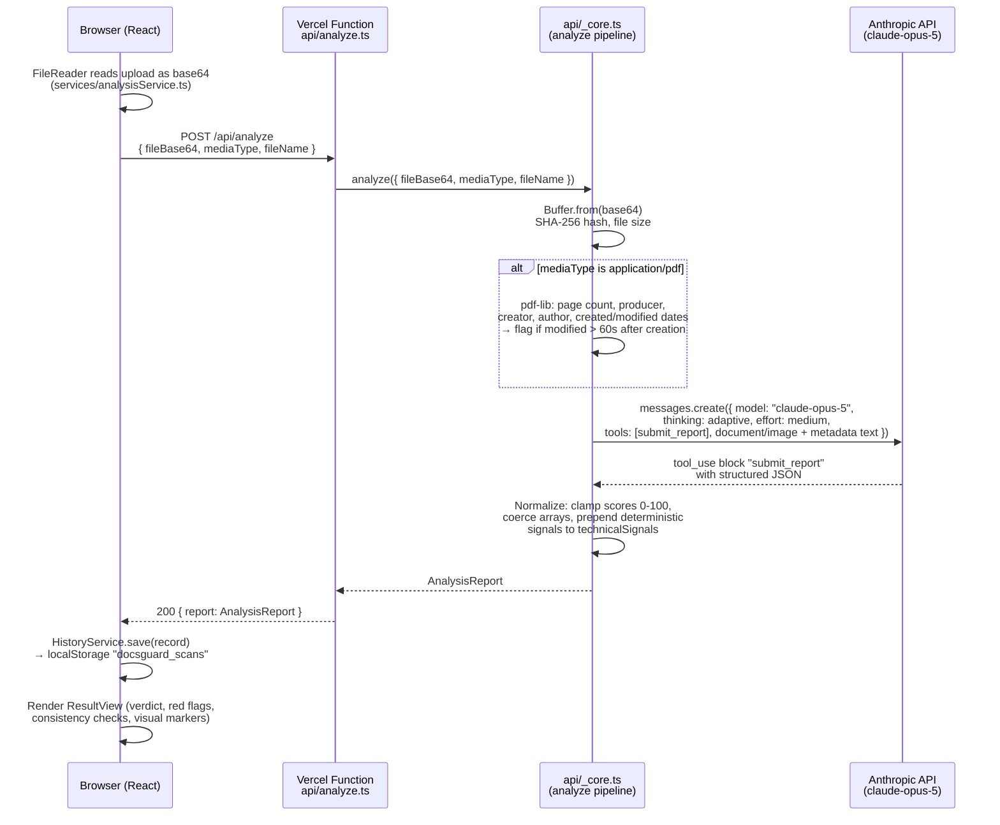

# DocsGuard — Technical Architecture

> **Code-update note (2026-09-20):** this doc was written against an earlier `api/_core.ts`.
> Now live in the engine: **`exifr` image EXIF/editor-tag extraction**, a **`web_search`
> server tool** (`web_search_20260209`, env `WEB_SEARCH_MAX_USES` default 4, `pause_turn`
> handled), and **effort `high`** (env `ANALYSIS_EFFORT`). The `maxDuration` mismatch is
> resolved — both `vercel.json` and `api/analyze.ts` are now **120s**. Where sections below say
> exifr/web-search are "not wired" or the durations "disagree", `api/_core.ts` / `api/analyze.ts`
> are the source of truth.

This document describes how DocsGuard is actually built today — not an aspirational roadmap. Where something is a declared dependency or a planned swap-in rather than live code, it is called out explicitly.

---

## 1. Component & data-flow overview

DocsGuard is a single-page React app plus one serverless function. There is no standing backend, no database, and no server-side document storage.

| Layer | Tech | File(s) |
|---|---|---|
| UI | React 19 + Vite 6, client-only routing via local state | `App.tsx`, `components/*` |
| Upload → API call | `fetch("/api/analyze")` | `services/analysisService.ts` |
| Serverless endpoint | Vercel Function (`@vercel/node`) | `api/analyze.ts` |
| Analysis pipeline (shared) | Node/TS, imported by both the Vercel function and the local Vite dev server | `api/_core.ts` |
| AI reasoning | Anthropic Claude API, `@anthropic-ai/sdk` | `api/_core.ts` |
| History | `localStorage`, Supabase-ready interface | `services/historyService.ts` |

**Why `api/_core.ts` is shared code, not duplicated logic:** `vite.config.ts` mounts a dev middleware at `POST /api/analyze` that calls `server.ssrLoadModule('/api/_core.ts')` and invokes the same `analyze()` function Vercel calls in production. Local `npm run dev` and the deployed app run the *identical* pipeline — the only difference is where the `ANTHROPIC_API_KEY` comes from (`.env.local` via Vite's `loadEnv` locally; `process.env` on Vercel).

### Request flow



Plain-text version of the same flow, for a quick read:

```
[Browser]
  FileUpload → File object
  analysisService.fileToBase64()          (client-side, FileReader)
  fetch POST /api/analyze  { fileBase64, mediaType, fileName }
        │
        ▼
[Vercel Serverless Function — api/analyze.ts]
  validate method + body → analyze(input)
        │
        ▼
[api/_core.ts — analyze()]
  1. Buffer.from(fileBase64, 'base64')
  2. extractMetadata():
       - SHA-256 (node:crypto)
       - file size in KB
       - if PDF: pdf-lib → page count, producer, creator,
         author, creation date, modification date
       - deterministic flag: modified - created > 60s ⇒ "edited after creation"
  3. Anthropic Messages API call:
       model: claude-opus-5
       thinking: { type: "adaptive" }
       output_config: { effort: "medium" }
       tools: [ submit_report (strict JSON schema) ]
       tool_choice: "auto"  (thinking stays enabled; prompt mandates the call)
       content: [ document/image block, metadata + task text block ]
  4. Extract the submit_report tool_use input (fallback: regex-parse a
     text block as JSON if the model didn't use the tool)
  5. Normalize + validate: clamp riskScore/confidence to 0-100, coerce
     verdict to the enum, ensure every array field exists, PREPEND the
     code-computed technicalSignals ahead of anything the model added
        │
        ▼
[Vercel Function] → 200 { report: AnalysisReport }  |  4xx/5xx { error }
        │
        ▼
[Browser]
  App.tsx: HistoryService.save({ id, createdAt, fileName, mediaType,
                                  thumbnail (data URL for images), report })
  ResultView renders: verdict badge, riskScore, redFlags, consistencyChecks,
  extractedFields, technicalSignals, recommendedAction, externalChecksNeeded,
  visualMarkers (bounding boxes drawn over the image, image documents only)
```

### What is real vs. declared

- **Real and wired in today:** SHA-256 hashing, file-size reporting, and PDF producer/creator/author/creation-vs-modification-date extraction via `pdf-lib`, all in `api/_core.ts`. These are the only signals computed deterministically in code; everything else (visual tampering assessment, OCR reading, cross-field consistency checks, extracted fields) comes from Claude's reasoning over the document itself.
- **Declared but not yet wired in:** `exifr` is a `package.json` dependency, but `api/_core.ts` does not currently call it — image EXIF/editor-tag extraction is not part of the live pipeline. Treat it as a near-term addition (parallel to the PDF branch, e.g. `exifr.parse(buf)` inside `extractMetadata` for `image/*` inputs), not a shipped feature.
- **Not implemented:** the Anthropic `web_search` server tool is not attached to the `messages.create` call in `api/_core.ts` today (no `tools` entry of type `web_search_20250305`, no `betas`/headers for it). Live external verification (business registries, e-District/DigiLocker, sanctions lists, bank confirmation) is handled by the model *declining* to assert those facts and instead populating `externalChecksNeeded` — per the system prompt's ground rules. Wiring in `web_search` (see §5) would let Claude close some of those gaps itself; until then, `externalChecksNeeded` is the honest boundary of what this build actually verifies.

---

## 2. The `AnalysisReport` data model

Defined once in `types.ts` and shared by client and server (the server has no separate schema file — `REPORT_SCHEMA` in `api/_core.ts` is the Anthropic tool `input_schema`, hand-kept in sync with the TS interface):

```ts
type Verdict = 'AUTHENTIC' | 'SUSPICIOUS' | 'LIKELY_FAKE';
type Severity = 'Critical' | 'High' | 'Medium' | 'Low';
type CheckStatus = 'PASS' | 'FAIL' | 'WARN';

interface AnalysisReport {
  documentType: string;              // e.g. "Income Certificate", "Bank Statement"
  verdict: Verdict;                  // 0-33 AUTHENTIC, 34-66 SUSPICIOUS, 67-100 LIKELY_FAKE
  riskScore: number;                 // 0-100, clamped server-side
  confidence: number;                // 0-100, clamped server-side
  summary: string;                   // 2-4 sentence plain-language explanation
  redFlags: {
    severity: Severity; title: string; detail: string; evidence: string;
  }[];
  consistencyChecks: {               // cross-field / arithmetic logic tests
    check: string; status: CheckStatus; detail: string;
  }[];
  extractedFields: { label: string; value: string }[];
  technicalSignals: {                // deterministic signals PREPENDED, then model-added ones
    label: string; value: string; concern: boolean;
  }[];
  recommendedAction: string;         // e.g. "approve", "request original", "escalate"
  externalChecksNeeded: string[];    // things Claude explicitly did NOT verify
  visualMarkers: {                   // images only; [] for PDFs
    label: string; severity: Severity;
    box: [number, number, number, number]; // [ymin,xmin,ymax,xmax], normalized 0-1000, top-left origin
  }[];
}
```

`ScanRecord` (also in `types.ts`) wraps a report for history storage: `{ id, createdAt, fileName, mediaType, thumbnail?, report }`.

**Server-side normalization** (`api/_core.ts`, end of `analyze()`) guarantees the client never has to defend against a malformed report: `riskScore`/`confidence` are clamped to `[0,100]` via `clamp()`, `verdict` falls back to `'SUSPICIOUS'` if the model returns anything outside the enum, every array field is coerced to `[]` if missing, and `technicalSignals` is always `[...deterministicSignals, ...modelSignals]` — so the real forensic facts are never overwritten or omitted by the model's output.

---

## 3. Security model

- **API key never reaches the browser.** `ANTHROPIC_API_KEY` is read only in `api/_core.ts` (`process.env.ANTHROPIC_API_KEY`, or `.env.local` via Vite's `loadEnv` in the dev-only middleware). No client bundle, network response, or source map contains it. `analysisService.ts` calls a same-origin relative path (`/api/analyze`) — the key is never a query param or client-visible header.
- **No document persistence server-side.** `api/_core.ts` holds the uploaded file only in memory (`Buffer.from(fileBase64, 'base64')`) for the duration of the request; nothing is written to disk or to a database on the server. History (`ScanRecord[]`, including a data-URL thumbnail for images) lives entirely in the browser's `localStorage` under `docsguard_scans` (migrated automatically from the legacy `pramaan_scans` key on first read), capped at 30 records (`services/historyService.ts`) — it is per-browser, not shared, and not visible to DocsGuard's operators.
- **Request-body limits:** Vercel serverless functions using the Node runtime accept up to ~4.5 MB request bodies by default (the platform's own `functions.api.body` limit — see `vercel.json`/Vercel docs for the current cap); there is no explicit override in this project, so uploads are implicitly bounded by that platform default. There is no client-side file-size check today — a large upload fails at the platform boundary rather than with an app-level error message, which is a reasonable hardening item.
- **Input validation is minimal by design for a hackathon build:** `api/analyze.ts` checks method (`POST` only) and the presence of `fileBase64`; it does not validate `mediaType` against an allowlist or cap `fileBase64` length before decoding. Malformed or oversized payloads currently surface as a 500 with the caught error message rather than a clean 400 — worth tightening before handling untrusted public traffic at scale.
- **Prompt-injection posture:** the system prompt explicitly forbids Claude from asserting the result of any external lookup (registries, WHOIS, sanctions, DigiLocker/e-District, bank confirmation) — those go into `externalChecksNeeded` instead of being fabricated. This is a prompt-level control, not a code-enforced one; there is no server-side filter that strips or checks for such claims in the model's output today.
- **Model output is server-normalized**, not trusted verbatim (see §2) — this closes off a class of "the model returned a broken enum / missing array" failures, but is not a security boundary against adversarial output content (e.g. the model echoing malicious text from a crafted document into `summary`); the frontend renders report fields as text, and any HTML-rendering path added later should treat model-derived strings as untrusted.

---

## 4. Performance & latency

Observed cost/latency levers, all currently hard-coded in `api/_core.ts`:

| Parameter | Current value | Effect of changing it |
|---|---|---|
| `model` | `"claude-opus-5"` | Opus 5 is Anthropic's top reasoning tier — best forensic/cross-field reasoning quality, highest per-token cost and typically the highest latency of the family. |
| `thinking: { type: "adaptive" }` | on | Lets the model allocate reasoning tokens adaptively per request rather than a fixed thinking budget; more consistent quality on hard cases, but thinking tokens are billed as output and add latency. |
| `output_config.effort` | `"medium"` | Claude Opus 5 supports `low / medium / high / xhigh / max` (Anthropic default is `high`). The code deliberately pins `medium` — per Anthropic's own guidance, `medium` is often the accuracy sweet spot on complex reasoning tasks, and it keeps demo latency predictable; dropping to `low` cuts latency/cost further at the risk of shallower cross-field checks, while `high`/`xhigh`/`max` spend more tokens without a guaranteed quality gain for this task shape. |
| `max_tokens` | `12000` | Ceiling for the structured `submit_report` output (including thinking tokens where applicable). Raising it protects against truncated reports on very field-dense documents at the cost of a higher worst-case bill; lowering it risks truncating a large `redFlags`/`consistencyChecks` array. |
| `tool_choice` | `{ type: "auto" }` | Left auto (not forced) specifically so adaptive thinking stays enabled — forcing `submit_report` would disable thinking. The system prompt, not `tool_choice`, is what makes the single tool call mandatory in practice. |

**Pricing context** (Anthropic's published rate, current as of the API pricing pages, Sept 2026): Claude Opus 5 is billed at **$5 / million input tokens** and **$25 / million output tokens**, the same rate as Opus 4.5 — with up to 90% savings available via prompt caching and 50% via batch processing (neither is used in this codebase today). A single document analysis call sends one document/image block plus a short metadata+task text block as input, and returns one structured JSON tool call as output — so cost per scan is dominated by output tokens (report size) and any thinking tokens, not input size, for typical single-page documents. *(Source: Anthropic's Claude Opus 4.5 pricing announcement and current model pricing pages — verify the live number on `https://platform.claude.com/docs/en/about-claude/models/overview` / `https://www.anthropic.com/pricing` before quoting it in a pitch, since rates can change.)*

**Tuning knobs for a live demo or a production rollout:**
- **Effort**: drop to `low` if you need snappier demo response times and are willing to trade off depth on subtle cross-field checks; the code already isolates this in one line (`output_config: { effort: 'medium' }`).
- **Model tier**: swapping `MODEL` to a smaller/faster Claude model would cut latency and cost, at a real loss of forensic reasoning quality for the visual/cross-field work this app is built around — Opus-tier reasoning is the product's core value, so this is a quality/cost tradeoff to make deliberately, not a default to change casually.
- **`web_search` `max_uses`**: not applicable yet since the tool isn't wired in (see §1); when added, `max_uses` caps how many searches Claude can run per request (Anthropic's docs show 5 as a typical starting value) — a directly-tunable latency and cost lever once external verification is live, since every additional search round-trip adds to end-to-end response time.
- **PDF metadata extraction** (`extractMetadata`) is synchronous, in-process, and fast (crypto hash + `pdf-lib` parse) — it is not a latency bottleneck; the Anthropic API call dominates total request time end-to-end.
- **`maxDuration`**: see §5 — this is the hard ceiling on how much of the above budget you can actually spend before the platform kills the request.

---

## 5. Deployment (Vercel)

- **Framework detection**: `vercel.json` pins `"framework": "vite"`, `buildCommand: "vite build"`, `outputDirectory: "dist"` — standard static frontend build, deployed to Vercel's edge/CDN.
- **Serverless function**: `api/analyze.ts` is auto-detected by Vercel's filesystem-based API routing (anything under `/api`) and deployed as a Node serverless function using `@vercel/node` types.
- **Function duration — two settings currently disagree, worth reconciling before shipping:**
  - `vercel.json` sets `"functions": { "api/*.ts": { "maxDuration": 120 } }` (120s, which requires at least a Pro-tier Vercel plan — Hobby caps at 60s).
  - `api/analyze.ts` itself exports `export const config = { maxDuration: 60 };` with a comment noting "Hobby allows up to 60s."
  - In practice the in-file `export const config` on the function is Vercel's documented per-function override mechanism, so `api/analyze.ts` most likely runs with the 60s ceiling regardless of the `vercel.json` value — but this project has not been verified against a live Vercel deployment as part of this doc, so treat 60s as the effective, demo-safe assumption and reconcile the two settings (pick one number, put it in both places, or remove the `vercel.json` override) before relying on 120s.
- **Environment variables**: exactly one is required — `ANTHROPIC_API_KEY`, set under Vercel → Project → Settings → Environment Variables (or `vercel env add ANTHROPIC_API_KEY`). It must never be prefixed `VITE_` (that would bundle it into the client). No other env vars are consumed by the current codebase; `VITE_SUPABASE_URL` / `VITE_SUPABASE_ANON_KEY` are referenced only in a comment in `services/historyService.ts` describing the not-yet-built Supabase swap (see §6), not read anywhere in code today.
- **Build/runtime**: no `vercel.json` `runtime` override — Vercel picks its default current Node runtime for the function; no explicit region pinning, so the function deploys to Vercel's default region for the project.
- **Local parity**: `npm run dev` (Vite) exercises the *same* `api/_core.ts` pipeline via the dev middleware in `vite.config.ts` — there is no separate "prod-only" code path to worry about breaking on deploy.

---

## 6. History storage: localStorage today, Supabase-ready

`services/historyService.ts` implements `HistoryService.{getAll, save, remove, clear}` entirely against `localStorage` (key `docsguard_scans`, with a one-time migration from the legacy `pramaan_scans` key if present, capped at 30 most-recent records, every operation wrapped in try/catch so quota/private-mode failures degrade to no-ops rather than throwing). This is genuinely local and per-browser — it is not shared across devices or visible to anyone but that browser's user, and it is lost if the user clears site data.

The file documents (but does not implement) the swap to a shared backend: gate on `import.meta.env.VITE_SUPABASE_URL` being set, dynamically `import("@supabase/supabase-js")`, and reimplement the same four methods against a `scans` table (`select ... order by created_at desc limit 30`, `upsert`, `delete`, `delete-all`), keeping `HistoryService`'s call signature unchanged so `App.tsx` and every other caller need no changes. `@supabase/supabase-js` is **not** currently a `package.json` dependency and no `supabase/schema.sql` migration file exists in the repo — this is a designed extension point, not a partially-built feature.

---

## Known gaps / honest TODOs surfaced by this document

1. `exifr` is installed but unused — image EXIF/editor-tag signals are not yet extracted.
2. `web_search` is not attached to the Claude API call — live external verification is not performed by this build; it is deferred to `externalChecksNeeded`.
3. `vercel.json`'s `maxDuration: 120` and `api/analyze.ts`'s `maxDuration: 60` disagree; reconcile before a real deploy.
4. No client- or server-side file-size/type allowlist beyond Vercel's platform-default request-body cap.
5. Supabase history backend is a documented plan, not code — `@supabase/supabase-js` isn't installed and no schema exists yet.
